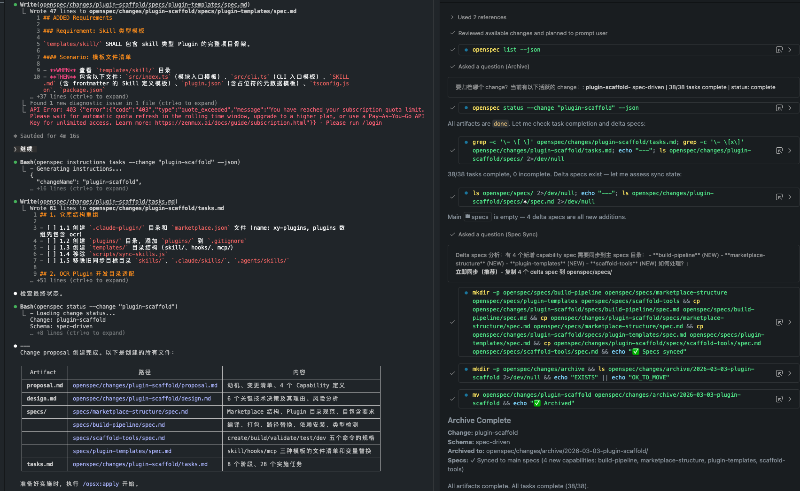

## 快速开始

目前对比了 spec-kit、openspec 两个 spec driven 的工具，个人体感是 openspec 更适合轻量使用，体感上对已有仓库的倾入性也更少

简单来说 spec driven 的研发模式，遵循以下两个原则：

1. 「先写规格，再写代码」—— 经过多步精化，而非一次性生成
2. 「动作，而非阶段」—— 流式迭代，随时可以对任意产物进行修改

相比单纯 Plan + 实施的优势：

- 持久化记忆
- 架构设计更细致，交互式决策
- 操作简易，使用直观
- 可断点续传，多 agent 接力适配（ClaudeCode、Github Copilot 无缝切换）

使用效果：

